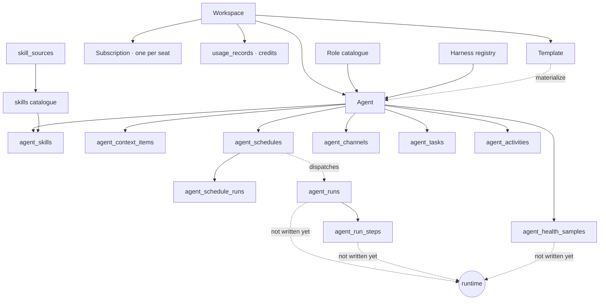

# ArkAgent — Product Specification

**What this is.** The "what the product is and what it does" document, for product, engineering
and the backend/runtime team. Every claim below was checked against the working tree on
2026-08-30, and then **fact-checked a second time against the same tree by a different reader**,
who corrected fifteen statements — the notable ones being harness gating (§6.2), config-revision
concurrency (§F5, §7.2), the cost route's ledgers (§F6) and `llm_usage.correlation_id` (§2), all of
which read as shipped and were not. Where a sibling doc disagrees with the code, **the code wins**
and the discrepancy is noted inline. Where a *source comment* disagrees with the code, the code
wins too, and that is called out — two of the corrections below are comments describing behaviour
that was never built.

**What this is not.** It does not restate `docs/SPEC.md` (the v1 technical blueprint: auth design,
rendering strategy, deployment) or `docs/PRP.md` (the requirements brief: the ten-item owner
request, the ambiguity ledger, the wave/AC mapping). It references both. `docs/TASK_PLAN_V2.md`
stays normative on engineering sequencing.

**Reading order.** §1 for the mechanic, §4 for the spine of the product, §5 for what actually
ships, §10 for what is still owed.

| Related document | Read it for |
|---|---|
| `docs/PRP.md` | The owner's ten requirements, the eleven standing assumptions, the wave→AC map |
| `docs/SPEC.md` | v1 architecture, auth, i18n, deployment, security posture |
| `docs/DATA_MODEL_V2.md` | Full DDL for every v2 table, with the reason for each column |
| `docs/BACKEND_INTEGRATION_CONTRACT.md` | The only document the runtime team needs |
| `docs/HARNESSES_AND_ACTIVITY.md` | Harness adapters, activity code vocabulary, empty states |
| `docs/REMINDERS_AND_SCHEDULERS.md` | Schedule execution, the claim protocol, misfire policy |
| `docs/SKILL_REPOSITORY.md` · `docs/AGENT_TEMPLATE_GENERATOR.md` | The two large v2 subsystems |
| `docs/API.md` · `docs/DATABASE.md` · `docs/PAYMENTS.md` | Endpoint, table and money references |

---

## 1. What ArkAgent is, in one page

ArkAgent sells a **hire, do not operate** mechanic. A customer does not configure a runtime, pick a
model, or write a prompt loop. They describe a job — "chase unpaid invoices every Tuesday and tell
me who did not reply" — and get back something shaped like an employee: a name, a role, a brief, a
set of rules it must not break, a schedule, and a record of what it did. The verbs in the product
are *hire*, *brief*, *pause*, *review* — not *deploy*, *configure*, *restart*.

### The control-plane / runtime split

This is the single most important structural fact about the codebase, and the one most likely to
be misread:

> **ArkAgent never executes an agent.** It writes rows. A separate service — the *Agent Manager* /
> *OpenClaw Manager*, owned by another team — reads those rows and runs the work on a remote VM.

| ArkAgent (this repo) owns | The Agent Manager / runtime owns |
|---|---|
| Identity, workspaces, sessions, billing | The VM, the container, the model calls |
| The agent record and its configuration | Executing a turn, a tool call, a schedule dispatch |
| Templates, skills catalogue, context items | Installing a skill, fetching a context file |
| Computing `next_run_at` and dispatching a due schedule | Doing the work the schedule asked for |
| Storing everything the runtime reports back | Reporting runs, steps, health, activity |

Two consequences that shape every screen:

1. **Anything the runtime has not reported does not exist.** The Activity surfaces read
   ArkAgent's own Postgres. Nothing today writes `agent_runs`, `agent_run_steps` or
   `agent_health_samples` — verified: there is no `insert(agentRuns)` anywhere in `app/`, `lib/` or
   `scripts/`. The empty states on those screens are the launch-day experience, not a bug.
2. **Unconfigured means "we cannot act", not "we cannot remember".** `agentManagerMode()`
   (`lib/agent-manager/index.ts`) resolves to `unconfigured` in production when no
   `AGENT_MANAGER_BASE_URL` is set, and agent *operations* refuse. The Activity routes deliberately
   answer `200` with an `emptyReason` instead, because the history is ArkAgent's own.

### The two markets

| | Global | China |
|---|---|---|
| Domain | arkagent.ai | iagent.cc |
| Default currency | USD (`$`) | CNY (`¥`) |
| Payment provider | Stripe | Alipay (`ALIPAY_ENABLED`) |
| Default UI languages | en, zht, ja | zh |
| Channel emphasis | Telegram, Slack, WhatsApp, LINE, Email | WeChat, Feishu, DingTalk, WeCom |

Currency follows language by default (`currencyForLang()` in `lib/pricing.ts`: `zh → cny`,
everything else `→ usd`) and a visitor can override it with the currency switcher, stored under
`localStorage["ark-currency"]`. **CNY is a local price ladder, not an FX conversion** — see §8.

All four UI languages (`en`, `zh`, `zht`, `ja`) are first-class. Dictionaries live per screen under
`lib/i18n/`, and key-set equality across all four is enforced by tests.

---

## 2. Personas, and the jobs they hire an agent to do

Three personas, unchanged in substance from `docs/PRP.md` §4 and repeated here only in the shape
this document needs.

### P1 · The operator-owner ("Wei") — founder or ops lead, 3–30 people

Buys the seat, writes the brief, notices when it goes wrong. Not technical enough to write a cron
expression; entirely technical enough to spot a fabricated number.

| Job to be done | What the product must give them |
|---|---|
| "I have work to offload and no idea what an agent should look like" | A template that states what the agent does, what it installs and how long setup takes — before anything is provisioned |
| "Do it every weekday at 08:30 and tell me what happened" | A schedule they can express in their own language, with the interpretation, timezone and next five fire times shown *before* saving |
| "Tighten what it may do without breaking it" | An editable configuration surface with an honest sync state |
| "Did it work, and what did it cost?" | Timeline → run → step trace, cost from real rows, or an honest empty state |

### P2 · The evaluator — first session, has not paid, decides in ten minutes

Sees exactly what a brand-new empty workspace sees. This is why "a new workspace sees no invented
data" is a P0: for this persona, invented data *is* the first impression, and discovering it is
fake is unrecoverable.

| Job | What the product must give them |
|---|---|
| "Show me this is real in five minutes" | Gallery → detail → "Start from this template" → a pre-filled wizard, with **no VM provisioned and no card charged** |
| "Show me it will not do something stupid" | RULES & BOUNDARIES visible *before* launch, as a section of the template — not a settings page found later |
| "I do not read English" | Four complete languages, including generated templates written natively in the requested locale |

### P3 · The platform operator — internal

Runs the deployment and curates the catalogue. Someone must publish skills or the catalogue is
frozen at its seed; someone must notice a generation failing.

| Job | What the product must give them |
|---|---|
| "Keep the catalogue current without shipping malware" | Sync writes `draft`; a human publishes; the host allowlist is a checked-in module reviewable in a PR |
| "Know why a generation failed" | `template_generations` rows. **Not `llm_usage.correlation_id` — `llm_usage` has no such column** (`lib/db/schema.ts` L932–961). `template_generations.correlation_id` exists and its own comment names a join target that is not in the schema; nothing writes or reads it. Grouping one user action's model calls is **not yet implemented** |
| "Deploy without accidentally simulating" | `AGENT_MANAGER_MODE` resolving to `unconfigured` in production rather than to a simulator |

### The persona ArkAgent deliberately does not serve

**The skill author.** There is no upload path, no authoring UI, no submission queue. Accepting
customer-authored skill code into a catalogue every other tenant reads inverts the entire safety
model.

---

## 3. The object model, in plain language

| Object | Table | Who creates it | What it is for |
|---|---|---|---|
| **Workspace** | `workspaces` | Signup | The tenant boundary. Owns credits, timezone, members, billing. Every query is scoped to it; a cross-workspace read returns **404, never 403** |
| **User / member** | `users`, `workspace_members`, `sessions` | Signup, invite, OAuth | Identity. `member_role` scopes inside one workspace; `platform_role` is platform-wide staff privilege |
| **Role** | `agent_roles` | Seeded catalogue (+ a synthetic `custom` row upserted by `GET /api/roles`) | The job title an agent is hired into — Sales Prospector, Admin Assistant, Legal Reviewer, OPC Operator, … Carries default brief text, default rules, an accent hue and a `min_plan` |
| **Agent** | `agents` | Hire wizard, or template materialization | The employee. Name, role, harness, brief (`instructions`), rules, `settings` JSONB, status, and the runtime linkage (`agent_manager_id`, `vm_id`). Also carries `config_revision` / `applied_config_revision` — the manifest handshake with the runtime |
| **Harness** | `engine` enum, built from `HARNESS_IDS` | Chosen at hire | The runtime that executes the agent. Four values; two provisionable (§6) |
| **Template** | `agent_templates` | The generator, a fork, or a platform seed | A reusable, reviewable **plan** for one-to-three agents. Holds a validated `AgentTemplateDraft` in `draft` JSONB plus denormalized card fields. `workspace_id IS NULL` = platform-curated. **A template is not an agent** — materializing one is a separate, idempotency-keyed act because it provisions a VM and bills a seat |
| **Skill** | `skills`, `skill_sources` | Sync from an allowlisted source; published by a human | A capability an agent can be given — a `SKILL.md` folder, an MCP server, or a skill pack. Deterministically risk-scored `low`/`medium`/`high` |
| **Attachment** | `agent_skills` | The user, or materialization | One skill pinned to one agent at one version, with install state and a harness-compatibility basis |
| **Context item** | `agent_context_items` | The user, or materialization | Reference material — a pasted text block, an uploaded file, or a URL the *agent's* sandbox fetches |
| **Schedule** | `agent_schedules` | The user, or materialization | When the agent should act on its own. `cron` \| `interval` \| `once`, in an IANA timezone, with a prompt, a delivery target and a per-day cap |
| **Run** | `agent_runs`, `agent_run_steps` | **The runtime — nothing writes these today** | One unit of work and its ordered step trace (`thinking`, `tool_call`, `tool_result`, `message`, `final_answer`) |
| **Activity** | `agent_activities` | ArkAgent bookkeeping today; the runtime later | The human-readable timeline line. Written today by exactly five modules — `lib/services/agents.ts` (OpenClaw provisioning succeeded, provisioning failed, and the lifecycle transition), `POST /api/agents/[id]/self-review`, the improvements route, the schedule tick, and the Manager webhook. Nothing else inserts into it |

### How they relate



ASCII equivalent, for a terminal:

```
workspace
├── subscriptions (one per agent seat) ── plans ── pricing ladder
├── usage_records (credits)
├── templates ──(materialize, idempotency-keyed)──▶ agents
└── agents
    ├── role (catalogue) · harness (registry) · settings (JSONB) · config_revision
    ├── agent_skills ──▶ skills ──▶ skill_sources
    ├── agent_context_items
    ├── agent_schedules ──▶ agent_schedule_runs ──┐
    ├── agent_channels ──▶ channels               │  dispatch
    ├── agent_tasks                               ▼
    ├── agent_activities  ◀── ArkAgent + runtime   agent_runs ──▶ agent_run_steps
    └── agent_health_samples                          ▲ (runtime only — empty today)
```

**Verified counts:** 37 tables, ten migrations `0000`–`0009`, 68 route handlers under `app/api/`
(`find app/api -name route.ts | wc -l`).

---

## 4. The six configuration sections — the spine of the product

Everything a customer decides about an agent lands in exactly one of six sections. They are the
same six in a template draft, in the AI-guided create flow, and (eventually) in the config editor,
so a generated template and a hand-edited agent cannot disagree about what a thing is called.

The draft contract is `AgentTemplateDraft` in `lib/atg/types.ts`; the live agent equivalent is the
`agents` row plus its four child tables.

### 4.1 At a glance

| Section | In a draft | Persists to | Edited today at | Status |
|---|---|---|---|---|
| **ROLES** | `draft.roles[]` (1–3) | `agent_roles` (catalogue) → `agents.role_id` | `/hire` step 1 · `RolesSection` in `app/hire/create/sections.tsx` | Catalogue shipped; draft section shipped |
| **AGENTS** | `draft.agents[]` (1–3) | `agents` (+ `agent_tasks`, `agent_channels`) | `/hire` · `/dashboard/fleet/[id]` → Settings tab · `AgentsSection` | Shipped |
| **SKILLS** | `draft.skills[]` (0–12) | `agent_skills` → `skills` | `/dashboard/skills` (browse) · `SkillsSection` | Browse + data model shipped; **per-agent attach/detach API not built** |
| **RULES & BOUNDARIES** | `draft.boundaries` | `agents.rules` (text) + `agents.settings` (JSONB) | `/hire` step 3 · Settings tab · `RulesSection` | Shipped at agent level |
| **CONTEXT** | `draft.context[]` (0–8) | `agent_context_items` | `ContextSection` in the create flow | Table + draft section shipped; **no API route, no upload path** |
| **REMINDERS & SCHEDULERS** | `draft.schedules[]` (0–8) | `agent_schedules` → `agent_schedule_runs` | `SchedulesSection` · `/api/agents/[id]/schedules*` | Engine + CRUD + preview shipped; agent-page editor not mounted |

### 4.2 ROLES

**Holds.** The job the agent is hired into: title, mission, responsibilities, success metrics,
stakeholders, handoffs. In a draft, a role may point at a catalogue row (`baseRoleId`) or stand
alone (`null`).

**Catalogue.** Eight seeded roles in `lib/data.ts` / `agent_roles` — `prospector`, `salesmkt`,
`admin`, `hr`, `support`, `legal`, `content`, `opc` — plus a synthetic `custom` row that
`GET /api/roles` upserts on every call. Each carries `min_plan`: `legal` needs Professional, `opc`
needs Director, the rest are Associate.

The catalogue is **not** static, which is easy to miss: the same `GET /api/roles` also calls
`listOpenClawManagerAgents()` and mirrors every Manager-side template into `agent_roles` as an
`ocm-<id>` row, so it stays compatible with the create-agent foreign key. A deployment pointed at a
populated Manager therefore shows more than nine roles, with `default_engine` inferred from the
Manager's `category_name` (`hermes` if the string contains it, else `openclaw`).

**Runtime.** The role is context and gating, not execution: it seeds the default brief and rules,
sets the accent hue, and determines the minimum plan. The runtime reads the *brief*, not the role.

### 4.3 AGENTS

**Holds.** Name, harness, primary flag, brief (`agents.instructions`), the behaviour settings
block, the tool switches, channels, and the starting task list.

**Persists to.** `agents` — with `settings` as a `StoredAgentSettings` JSONB merged over
`DEFAULT_SETTINGS` on read (`mergeSettings()` in `lib/agent-settings.ts`). Tasks go to
`agent_tasks`; channel links to `agent_channels`.

**The settings vocabulary** (`AgentSettings`, verified field-by-field):

| Group | Fields | Default |
|---|---|---|
| Behaviour | `tone`, `responseLanguage`, `timezone` | `professional`, `auto`, `Asia/Singapore` |
| Autonomy & approvals | `autonomy`, `approvalAmount`, `approveExternalSends`, `dailyActionLimit` | `ask`, `300`, `false`, `0` (unlimited) |
| Working hours | `alwaysOn`, `workStart`, `workEnd`, `workDays`, `heartbeatMinutes` | `true`, `09:00`, `18:00`, Mon–Fri, `15` |
| Escalation | `escalateTo`, `notifyNeedsReview`, `notifyErrors`, `dailyDigest`, `digestTime` | empty, `true`, `true`, `true`, `18:00` |
| Model | `model`, `temperature`, `maxTokens`, `reasoningEffort` | `auto`, `0.4`, `4096`, `medium` |
| Memory | `memoryEnabled`, `retentionDays`, `knowledgeUrls` | `true`, `90`, `[]` |
| Limits | `monthlyCreditCap` | `0` (use the plan allowance) |
| Tools | `tools.{shell,files,browser,docker,code}` | files + browser on, the rest off |
| Self-improvement | `selfImprove`, `autoCreateSkills` | `true`, `true` |

`approvalAmount` is denominated in `APPROVAL_CURRENCY` (USD) as a whole unit, **deliberately
independent of the viewer's display currency** — re-reading a stored `300` as ¥300 because someone
flipped the price toggle would silently tighten every agent's escalation rule.

**Runtime.** `agents.config_revision` is the manifest version the runtime polls against;
`applied_config_revision` is what it has actually applied. Behind ⇒ a resync is due.

The **rule** (stated on the column in `lib/db/schema.ts` L541–547) is that the revision must be
bumped in the *same transaction* as any write to the brief, settings, tasks, skills, context items,
schedules or channel links — child-table writes included. **What actually happens today** is
narrower, and the gap is worth knowing before anyone builds against it:

| Writer | Bumps `config_revision`? |
|---|---|
| `PATCH /api/agents/[id]` (name, brief, rules, plan, harness, settings) | Yes — an in-place `config_revision + 1`, unconditionally |
| The schedules writer (`lib/services/schedules.ts` L543) | Yes |
| The channel re-link inside that same PATCH | **No** — it runs after the `UPDATE`, in a separate statement, not one transaction |
| Tasks, skills, context items | No writer exists at all (§4.4, §4.6) |

Those two are the only `configRevision` writes in `app/` or `lib/`.

### 4.4 SKILLS

**Holds.** Which catalogue skills this agent has, pinned to a version, with an accepted risk level
and a harness-compatibility basis.

**Persists to.** `agent_skills` (the attachment) referencing `skills` (the catalogue). Identity is
`(source, ownerHandle, slug)`, minted into a `public_id` by `lib/skills/public-id.ts`.
`GET /api/skills/[slug]` resolves a `public_id` first and falls back to a **unique** bare-slug
match; an ambiguous bare slug is a `409` carrying the candidate `(publicId, ownerHandle, sourceId)`
triples, never a silent pick of whichever row sorted first.

**Catalogue.** 16 categories (`skill_category`), three formats (`agent_skill`, `mcp_server`,
`skill_pack`), four statuses (`draft`, `published`, `deprecated`, `blocked`). A deterministic
scorer in `lib/skills/safety.ts` produces a `low`/`medium`/`high` band from capability blast radius
plus trust modifiers, with floors popularity cannot launder away; `withReviewerScore()` lets an LLM
only *raise* a band via `maxBand()`, never lower one.

**Compatibility carries its basis, and the basis is four-state — not three, and there is no
`asserted`.** `CompatBasis` in `lib/runtime/types.ts` is `verified` | `declared` | `inferred` |
`unknown`, and it travels beside a separate `supported` boolean. `/dashboard/skills` renders the two
as adjacent words per harness — "supported · inferred", "unsupported · unknown" — not as a ✓/✕/⚠
glyph; no such iconography exists in the tree. The point of keeping `unknown` distinct is that it
must read as *untested*, never as a green tick.

**Runtime.** The runtime installs the pinned version into the harness's skill directory
(`.agents/skills` for all four harnesses) and reports install state back through `agent_skills.state`
(`pending` → `installing` → `installed` | `failed`, plus `removing`/`removed`).

**Honest gap.** `app/api/agents/[id]/skills/` exists as an **empty directory** — there is no
attach/detach endpoint. The browse page and the data model are real; wiring a skill to an agent from
the UI is not.

### 4.5 RULES & BOUNDARIES

**Holds.** What the agent must never do, and what needs a human first. In a draft:
`boundaries.autonomy`, `approvalAmountUsd`, `approveExternalSends`, `dailyActionLimit`, 3–12
typed `rules` (`hard`/`soft`, categorised `money` \| `external_comms` \| `data` \| `scope` \|
`quality` \| `legal` \| `safety` \| `schedule`), up to 10 `prohibitions`, an `escalation` block,
`dataHandling` (PII, retention, redaction) and a `spend.monthlyCreditCap`.

**Persists to.** At agent level this splits: the prose lands in `agents.rules` (text), the numeric
and enum policy in `agents.settings`. There is no `rules` child table.

**One deliberate refusal worth knowing about.** `TemplateBoundaries.escalation.to` is typed
`null`, not `string | null`. A model that emits an address there has either hallucinated one or
lifted one out of the user's brief, and both write a stranger's address into an agent's
notification config. The UI collects it after materialization.

**Runtime.** Boundaries are policy the runtime is expected to enforce before acting — the
approval threshold, the external-send gate, the daily action cap. ArkAgent stores and displays
them; it cannot enforce them inside a turn it does not execute.

### 4.6 CONTEXT

**Holds.** Reference material: a pasted text block, a file the user is asked to upload, or a URL.

**Persists to.** `agent_context_items`, with `kind` ∈ `file` \| `text` \| `url` and a state machine
`awaiting_upload` → `pending` → `indexing` → `indexed` \| `failed`, `removed` terminal. Only the
template generator writes `awaiting_upload`; the runtime reports every other transition. A row in
`awaiting_upload` **has no bytes** and the runtime must skip it rather than fetch a null
`content_url`.

**Three safety properties baked into the columns.** `text_body` is untrusted user content and goes
into a prompt as *data*. `source_url` is fetched **in the agent's egress sandbox, never from the
control plane** — it is a user-supplied URL and therefore an SSRF vector. `isSafePublicHttpsUrl()`
(`lib/atg/safety.ts`) is stricter than "no private addresses": it requires `https:`, refuses any
port but 443, refuses embedded `username`/`password`, refuses private and link-local IPv4 and IPv6,
refuses `.local` / `.internal` / `.home.arpa`, and refuses a bare dotless label such as `intranet`,
which resolves through the search domain on most corporate networks. `content_url` is served against the per-agent
manifest token with `Cache-Control: no-store`.

**Limits.** Platform ceiling 20 MB per item; a template may set a tighter `maxBytes` (default
10 MiB). Text-only formats at launch.

**Honest gap.** There is **no `app/api/agents/[id]/context/` route and no upload endpoint**. The
table, the draft section and the UI types exist; the write path does not. See §10 for the storage
decision this is blocked on.

### 4.7 REMINDERS & SCHEDULERS

**Holds.** When the agent acts on its own: a kind (`cron` \| `interval` \| `once`), an IANA
timezone, a prompt injected as a **user** turn, a delivery target, an overlap policy, a catch-up
policy, jitter, a runtime ceiling, and a per-day circuit breaker.

**Persists to.** `agent_schedules`, with per-fire history in `agent_schedule_runs` and a tick
ledger in `scheduler_ticks`.

**The invariants are constraints, not conventions** — verified in `lib/db/schema.ts`:

| Constraint | What it prevents |
|---|---|
| `agent_schedules_shape` | Each arm asserts its own discriminant present **and** the other two absent, so `kind='cron'` with `interval_seconds=5` cannot be stored |
| `agent_schedules_enabled_next` | Enabled ⇒ `next_run_at IS NOT NULL`; disabled ⇒ NULL. A crashed tick cannot leave a recurring schedule permanently outside the due index |
| `agent_schedules_jitter` | 0–3600s. Negative jitter would walk `next_run_at` backwards and re-fire a completed occurrence |
| `agent_schedules_runs` | `max_runs_per_day` 1–288 — the circuit breaker for a mis-parsed every-minute cron |
| `agent_schedules_runtime` | `max_runtime_seconds` 30–86400 |

**How a fire happens.** `vercel.json` runs `/api/cron/schedules` every minute. The route accepts
GET (Vercel) and POST (tests, external pingers), both guarded by `Bearer CRON_SECRET` compared with
`timingSafeEqual` and **failing closed when the secret is unset**. `x-vercel-cron` is explicitly
*not* accepted as authentication — it is a client-settable header on a public URL — and is read
only to label the ledger row. Due rows are claimed with a durable lease
(`claimed_at` + `claim_token`) rather than an open transaction, so a killed worker's claim expires
instead of vanishing. The lease is `SCHEDULER_LEASE_SECONDS`, **default 300** — it is an env var,
not a constant. Route `maxDuration` is 60s and must stay below it.

**Runtime.** ArkAgent computes `next_run_at`, claims, advances, inserts the occurrence, then
dispatches. The runtime executes the prompt. `next_run_at` is advisory for the runtime and
authoritative for the tick.

**Ordering trade, stated plainly:** claim → advance + insert → dispatch means a duplicate fire is
impossible and a lost fire is bounded and visible. That is the right way round for a product that
sends emails.

---

## 5. Feature-by-feature spec

The ten requirements from `docs/PRP.md` §1, in the owner's original numbering. Acceptance criteria
are stated as observable behaviour; the `AC-*`/`TC-*` identifier namespace lives in
`docs/TEST_PLAN_V2.md` §B and is not duplicated here.

**Status legend.** **Shipped** = built and verified in the tree · **Partial** = the useful half is
there and the gap is named · **Not started** = no code.

### Status summary

| # | Feature | Status |
|---|---|---|
| 1 | Mock-data cleanup | Partial |
| 2 | AI guidance | Partial |
| 3 | Template-driven creation | Partial |
| 4 | Reminders & Schedulers | Shipped |
| 5 | Agent config management | Partial |
| 6 | Rich activity | Partial (read layer shipped, no writer) |
| 7 | Agent Template Generator | Partial |
| 8 | Skill Repository | Partial (catalogue empty) |
| 9 | Template page | Partial (page shipped, API missing) |
| 10 | Contrast & weight | Shipped |

---

### F1 · Mock-data cleanup

**User problem.** A workspace with zero agents opened Billing and saw a 14-bar credit chart, "4
agent seats" and a cycle estimate — none of it theirs. A workspace with a null channel label read
"USED BY NOVA" on its own Channels screen. The landing page promised a 14-day trial that
`stripeTrialDays()` returns `0` for. Each is a trust loss no later feature recovers.

**How it works today.** `lib/services/billing.ts` computes usage by summing real `usage_records`
rows for the caller's own workspace, bucketed by day; the workspace id comes from the session,
never the query string. The fabricated `getBillDatasets` and proration helpers are gone. The two
unbacked pricing claims are cut. `SEED_DEMO=1` **throws** under `NODE_ENV=production`
(`lib/db/seed.ts`), and `/directions` `notFound()`s unless `NEXT_PUBLIC_SHOW_DIRECTIONS=1`.

**Acceptance criteria.**
- A brand-new empty workspace renders no number that is not a Postgres row or an explicit zero.
- Billing usage for workspace A never includes a row belonging to workspace B.
- Seeding the demo workspace in production fails loudly rather than silently.

**Status: Partial.** The billing chart, the channel note and both pricing claims are fixed and
verified. What remains in `lib/data.ts` is **one** fabricated surface, not four — the earlier
grouping of all four as "marketing fixtures" was wrong:

| Export | What it actually is |
|---|---|
| `heroFeed` | **The only invented data left.** Six hardcoded agent-activity lines ("Qualified lead: Meridian Logistics"), rendered four at a time on `app/page.tsx` as a scrolling timeline. Label it as an illustration or delete it |
| `landingRoles`, `genTexts` | **Seed input, not decoration.** `lib/db/seed.ts` imports both to populate the real `agent_roles` catalogue. Deleting them breaks `npm run db:seed` |
| `channelDefs` | **The channel catalogue.** `app/dashboard/channels/page.tsx` iterates it to drive real connect/disconnect calls |

---

### F2 · AI help for a user who does not know what to build

**User problem.** A blank textarea asking for a "job brief" is a wall. The user knows the job, not
the vocabulary.

**How it works today.** Two real, shipped assists, both with deterministic fallbacks:

| Assist | Endpoint | No-key behaviour |
|---|---|---|
| Generate a brief or rules for a role | `POST /api/agents/generate-brief` | Returns the role's seeded `default_instructions` / `default_rules` with `source: "default"` |
| Interpret a scheduling phrase | `POST /api/agents/[id]/schedules/preview` | Falls back to the deterministic parser in `lib/schedule/parse.ts`; the model is only ever a second opinion, capped at `LLM_CONFIDENCE_CEILING = 0.85` |

The preview route **never 500s on bad input** — a malformed cron or an unreadable phrase is a
result, returned as data with a 200, because the editor calls it while the user is still typing.
Rate-limiting the model branch returns `x-schedule-parse-rate-limited` rather than a 429.

**Acceptance criteria.**
- Every AI affordance produces the same output *shape* with and without `OPENROUTER_API_KEY`.
- No suggestion may enable a tool, raise autonomy, raise a spend limit, or attach a high-risk
  skill. Suggestions are restrictive-only.
- Untrusted text never reaches a system prompt.

**Status: Partial.** The per-field assists are shipped. The **docked assistant panel** specified for
four screens (`/hire`, `/dashboard/templates`, `/dashboard/skills`, agent config) does not exist —
there is no assistant component under `components/`. `docs/PRP.md` §3.1 row 13 already flags this as
a scope gap in the wave plan rather than an implementation slip.

---

### F3 · Template-driven creation that generates all six sections

**User problem.** Creating an agent was a five-field form. Nothing told the user what a good
configuration looks like.

**How it works today.** Two entry points, deliberately both kept:

- `/hire` — the four-step wizard, for a user who already knows the role they want.
- `/hire/create` — the AI-guided flow: `DescribeStep` → `GeneratingStep` → `ReviewStep`, with all
  six sections rendered and editable in `app/hire/create/sections.tsx` (`RolesSection`,
  `AgentsSection`, `SkillsSection`, `RulesSection`, `ContextSection`, `SchedulesSection`).

**Acceptance criteria.**
- A gallery click never provisions a VM and never charges a card.
- Generation produces all six sections at once, or a deterministic draft with the same shape.
- Materialization is a separate, explicit, idempotency-keyed act (`agents.idempotency_key`, unique
  per workspace, cleared after 24h).

**Status: Partial.** The whole client-side flow is built and covered by `tests/create-flow.test.ts`.
It calls `POST /api/templates/generate`, `GET /api/templates/generations/{id}`,
`POST /api/templates/generations/{id}/cancel`, `POST /api/templates/{id}/materialize` and
`POST /api/templates` — **none of which exist**: there is no `app/api/templates/` directory. The
flow cannot complete end to end today.

---

### F4 · Reminders & Schedulers

**User problem.** There was no schedule surface at all. "Every weekday at 08:30" was not
expressible.

**How it works today.** A dependency-free cron engine — `lib/schedule/cron.ts` (parse, next-run,
IANA/DST), `parse.ts` (natural language, four languages), `describe.ts` (render a cron back as a
sentence in the viewer's language). CRUD at `/api/agents/[id]/schedules`, per-schedule history at
`.../[scheduleId]/runs`, live interpretation at `.../preview`. The tick is `/api/cron/schedules`,
scheduled `* * * * *` in `vercel.json`.

**Acceptance criteria.**
- The user sees the interpretation, the timezone and the next five fire times **before** saving.
- Dispatch is exactly-once per scheduled instant under concurrent ticks.
- DST transitions do not double-fire or skip.
- A failed run cannot wedge a schedule out of the due index.

**Status: Shipped.** Verified end to end: a due schedule is claimed, dispatched, `next_run_at`
advanced, a run row recorded, and a second tick produces **no** duplicate. Covered by
`tests/cron.test.ts`, `schedule-parse.test.ts`, `schedule-describe.test.ts`,
`schedules-plan.test.ts`, `schedules-safety.test.ts`.

**Caveat.** The schedule editor is not mounted on the agent detail page yet — the API and the
engine are ahead of the UI surface that consumes them. `/api/cron/schedules` also assumes
minute-granularity Vercel cron, which is a paid-plan feature (§10).

---

### F5 · Edit and manage agent configuration

**User problem.** The settings tab had hardcoded English labels and a save that did not reach the
runtime.

**How it works today.** `/dashboard/fleet/[id]` has six tabs: `activity`, `tasks`, `chat`,
`performance`, `usage`, `settings`. The Settings tab writes the `agents` row and its `settings`
JSONB. `PATCH /api/agents/[id]` is the write path; `POST /api/agents/[id]/lifecycle` handles
`pause` | `resume` | `terminate`.

**Acceptance criteria.**
- Concurrency is detected on `config_revision`, not on a parent row's `updated_at`.
- No secret is ever serialised into a client payload.
- Every label is localised in all four languages.
- The UI shows a truthful sync state: `config_revision` vs `applied_config_revision`.

**Status: Partial.** The columns and the vocabulary are in place: `config_revision` /
`applied_config_revision` exist, and `components/manage/` carries the DTO types, the section-count
logic and the primitives. But `MANAGE_SECTIONS` is `["rules", "skills", "context", "schedules"]` —
four sections, not the nine the design calls for — and `app/dashboard/fleet/[id]/tabs/` is an
**empty directory**. The two-pane editor is not built; the old Settings tab is what ships.

Three of the four acceptance criteria above are **goals, not current behaviour**, and were
previously written as though they were shipped:

- **Concurrency detection does not exist.** `PATCH /api/agents/[id]` reads no `If-Match`, takes no
  expected revision, and can return no `409`. It increments `config_revision` in place and writes.
  Two editors silently last-write-wins; the increment prevents a *lost bump*, not a lost edit.
- **The sync state is never shown.** `serializeAgent()` computes
  `configSynced = applied >= current`, and no component reads it: `configSynced`, `configRevision`
  and `resync` appear in zero `.tsx` files under `app/dashboard/` or `components/`.
- **Harness changes are not gated on PATCH.** `updateAgentSchema.engine` is
  `z.enum(HARNESS_IDS)` with no `isHarnessEnabled()` check, so the Settings tab can move a live
  agent onto `codex` or `deepseek` — see §6.2.

What *is* true: no secret is serialised into the agent payload, and the Settings tab's labels go
through `lib/i18n/fleet-detail.ts` in all four languages.

---

### F6 · Far more detailed activity, from the database

**User problem.** "Did it work, and what did it cost?" had no answer beyond a status pill.

**How it works today.** A complete read layer — `lib/activity/queries.ts`, `serialize.ts`,
`validation.ts`, `route-helpers.ts`, `client.ts` — behind four routes:

| Route | Serves |
|---|---|
| `GET /api/agents/[id]/activity` | Merged timeline over `agent_runs` + `agent_activities`, keyset-paged. Filters: `from` `to` `cursor` `limit` `q` `severity` `trigger` `outcome` `type` `tag` `channel` `session` `run` `model` |
| `GET /api/agents/[id]/runs` · `/runs/[runId]` | Run list and drill-down with the ordered step trace |
| `GET /api/agents/[id]/health` | Health samples |
| `GET /api/agents/[id]/activity/cost` | **Three ledgers, deliberately never merged**: `agent_runs` (runtime-reported cost/tokens — empty today), `llm_usage` (ArkAgent's *own* model spend on this agent's behalf — the one that is non-empty today), and `usage_records` (credits, **not** converted to money, because an invented exchange rate is exactly the plausible fake number this route exists to avoid). All money is micro-USD, converted once at render |

Filters compose; an unrecognised filter *value* is dropped and reported in `ignoredFilters` rather
than reaching an `inArray` against a pgEnum and returning a 500 carrying the enum's value list. A
malformed *structural* parameter is a 4xx with a machine `code`.

**Acceptance criteria.**
- Identical DTO shape for all four harnesses.
- Activity rows stored as a code plus parameters, rendered per language at read time — never as
  prose frozen at ingest.
- A quietly reduced result count is always explained.
- Empty is a designed state with an `emptyReason`, not a blank panel.

**Status: Partial — and this is the most important honest statement in the document.** The read
layer is shipped and tested (`tests/activity-serialize.test.ts`, `activity-taxonomy.test.ts`).
**Nothing writes `agent_runs`, `agent_run_steps` or `agent_health_samples`.** `agent_activities` *is*
written — by `lib/services/agents.ts` (lifecycle), `app/api/agents/[id]/self-review`, the
improvements route, the schedule tick, and the Manager webhook — so the timeline has ArkAgent's own
bookkeeping lines and nothing else. The backend/runtime team implements against
`docs/BACKEND_INTEGRATION_CONTRACT.md`. **Until they do, the run, step and health empty states are
the launch-day experience.**

---

### F7 · Agent Template Generator

**User problem.** Writing six coherent configuration sections from scratch is expert work.

**How it works today.** A ten-stage pipeline — `intake`, `charter`, `capabilities`, `skills`,
`boundaries`, `context`, `schedules`, `assemble`, `lint`, `finalize` — producing one validated
`AgentTemplateDraft`. Two design decisions worth restating:

- **The model never names a skill.** It names *capabilities*; a database query turns capabilities
  into version-pinned identifiers. A hallucinated package name cannot become an install.
- **Computed fields are computed.** `estimatedCreditsPerMonth`, `difficulty`,
  `timeToValueMinutes`, `automates` and `humanReadable` are all derived, never model-authored;
  `containsPii` is set by the linter.

**Acceptance criteria.**
- Every stage has a deterministic fallback; with no LLM key the pipeline still emits a valid draft.
- A draft with an unknown `schemaVersion` 409s at materialize rather than being coerced.
- Injection findings are recorded in `provenance.injectionFindings` and never silently dropped.
- A `codex`/`deepseek` draft generates and stores, but refuses at materialize in live mode.

**Status: Partial.** Present and compiling: `types.ts`, `schema.ts`, `defaults.ts`, `safety.ts`,
`prompts.ts`, `validate.ts`, `pipeline.ts`, `deterministic.ts`, `retrieval.ts`. **Missing:**
`lib/atg/materialize.ts`, and every route under `app/api/templates/` — that directory does not
exist. So the pipeline can produce a draft and nothing can turn one into an agent, and no HTTP
surface reaches any of it.

---

### F8 · Skill Repository

**User problem.** "What can this agent actually do?" needs an answer a human can browse and a
generator can query.

**How it works today.** `skills` + `skill_sources` + `agent_skills`; a deterministic scorer; a
browsable `/dashboard/skills`; a locked-down sync pipeline; `GET /api/skills`,
`GET /api/skills/[slug]`, `POST /api/skills/sync` (scheduled `17 3 * * *` in `vercel.json`).

**The sync pipeline's locks, verified in `lib/skills/sync/fetch.ts`:**

| Lock | Value |
|---|---|
| Host allowlist | `clawhub.ai`, `api.github.com`, `registry.modelcontextprotocol.io` — anything else throws `host_not_allowed` |
| Scheme | `https:` only |
| Path segments | Validated against `/^[A-Za-z0-9._-]{1,120}$/`, never escaped — a `..` is upstream drift and is skipped |
| Body cap | 512 KB; static analysis says it ran on a truncated buffer |
| Timeout | 15s |
| Auth | `requirePlatformRole("admin")` **or** `Bearer CRON_SECRET`; `support` excluded because sync writes the one table every customer reads. `x-vercel-cron` is not an authenticator |
| Lease | 15 minutes; a concurrent run gets 409, which is expected rather than a failure |

**Acceptance criteria.**
- Nothing a crawler finds is customer-visible until a human publishes it (`status='draft'` on
  write).
- `GET /api/skills` makes no outbound request, ever — a hostile upstream can make the catalogue
  stale, never make the page hang.
- A publisher's bytes render as text nodes only; no `dangerouslySetInnerHTML`, and deliberately not
  through the `react-markdown` already in the tree.
- An absent compatibility entry reads "untested", never "supported".
- An upstream failure is a `200` with `error` set and `fetched: 0`, so Vercel does not retry it.

**Status: Partial.** All of the above is shipped and tested (`tests/skills-api.test.ts`,
`skills-catalog.test.ts`, `skills-safety.test.ts`). **The catalogue is empty.** `lib/skills/catalog.ts`
— the seed (`docs/PRP.md` §3.1 row 5 budgets it at 101 entries; nothing in this tree can confirm a
count for a file that does not exist) — is absent, and `npm run skills:seed` points at
`scripts/seed-skills.ts`, which is **not in the tree** (`scripts/` contains only `check-llm.ts`,
`check-migrations.ts`, `check-payments.ts`, `check-pricing.ts`, `sync-skills.ts`). Until the seed
lands, `/dashboard/skills` renders its empty-catalogue state and `POST /api/skills/sync` answers
`404 Unknown source` for every id, because `skill_sources` has no rows.

---

### F9 · Redesign the template page

**User problem.** The role roster answered "what job title?" with five columns and nothing else.

**How it works today.** `/dashboard/templates` — card and list views with a stored per-viewer
preference, filters and sort in the URL so a filtered gallery is linkable and the back button works,
and a detail drawer. Components live in `components/template/`.

**Acceptance criteria.**
- "Start from this template" routes to the pre-filled wizard; it does not provision.
- No value on a card is computed at render — every one is a stored column.
- A `GET /api/templates` failure renders the error frame with the control bar still populated,
  never a crash and never a blank page.

**Status: Partial.** The page is shipped and covered by `tests/template-gallery.test.ts`, and the
nav links to it. `GET /api/templates` does not exist, so the page renders its error frame — which
is exactly the degradation it was designed for, but it is not a working gallery.

---

### F10 · Contrast and weight

**User problem.** "The font color is too grey." The `AAA` claim in `app/globals.css`'s header
comment was false in five of the six palettes — ivory-light's `--c-muted` measured **4.13:1** against
a stated 7:1 — and the product leans hard on 10–12px mono for labels, badges, timestamps and ticks.

**How it works today.** A four-tier ramp with contrast floors, enforced by `tests/contrast.test.ts`,
which **parses the stylesheet itself** rather than a copy of the values, so a hand edit to a palette
cannot pass while the tokens say otherwise. Every tier is checked against all four surfaces it can
be painted on.

| Token | Floor | Use |
|---|---|---|
| `--c-text` | 13:1 | Headings, values, active nav |
| `--c-text2` | 9.5:1 | **Default body copy** |
| `--c-muted` | 7:1 | Secondary copy, all mono field labels |
| `--c-faint` | 4.5:1 | Tertiary only — never a sentence a user must read to operate the product |
| status / accent | 4.5:1 | They are used at 11px |
| `--c-border-field` | 3:1 | WCAG 1.4.11, non-text |

**Status: Shipped.** All six palettes pass.

---

## 6. The four harnesses

A **harness** is the runtime that actually executes an agent on its VM. The database column is
still called `engine` — renaming a live `pgEnum` is not worth the migration — but everything above
the schema says *harness*, because that is the word the product and the runtime team use.

The set is defined once, in `lib/harness/index.ts`, and `lib/db/schema.ts` builds its `pgEnum` from
it. Adding a fifth means editing `HARNESS_IDS` and `HARNESS_PROFILES` and then fixing whatever stops
type-checking; every exhaustive `Record<Harness, …>` becomes a compile error, which is the point.

| Harness | Vendor | What it is for |
|---|---|---|
| **OpenClaw** | OpenClaw | The default. Full local execution — shell, files, browser, Docker, code — and the broadest channel coverage. The one harness with a verified messaging surface |
| **Hermes** | Nous Research | Reasoning-led, self-improving; interprets `reasoningEffort` as *depth*. No browser. Channels unverified |
| **Codex Harness** | OpenAI | Repository-scoped coding. No messaging surface at all. Model family pinned to `codex` |
| **DeepSeek Harness** | DeepSeek | Files and network only. Does not execute code. Model family pinned to `deepseek` |

### 6.1 The capability matrix — tri-state, and "unknown" means *unverified*

`HARNESS_PROFILES` in `lib/harness/profiles.ts` is the source. The distinction is load-bearing:
`"unknown"` is not a hedge, it is the state that will let the config editor say **"unverified on
this runtime"** instead of hiding a control or, worse, showing one that silently does nothing.

**Status caveat, because the intent above reads as shipped and is not.** `HARNESS_PROFILES` is
consumed by `lib/harness/index.ts` and by tests, and by nothing under `app/` or `components/` — the
config editor it was written for is the one that is not built (§F5). Today the tri-state is a
correct data model with no reader in the UI.

Tools:

| | shell | files | browser | docker | code |
|---|---|---|---|---|---|
| openclaw | yes | yes | yes | yes | yes |
| hermes | yes | yes | no | unknown | yes |
| codex | yes | yes | no | no | yes |
| deepseek | unknown | yes | no | unknown | **no** |

Memory, models, channels:

| | selfImprove | autoCreateSkills | provider-agnostic | pinned family | channels |
|---|---|---|---|---|---|
| openclaw | yes | yes | yes | — | 10 (telegram, whatsapp, wechat, line, slack, email, web, feishu, dingtalk, wecom) |
| hermes | yes | yes | yes | — | **unknown** (CONFIRM-6) |
| codex | no | no | no | `codex` | none |
| deepseek | unknown | unknown | no | `deepseek` | none |

Runtime surfaces ArkAgent asks about (`chat`, `sessions`, `channels`, `tasks`, `runs`, `steps`,
`skills`, `context`, `health`):

| | verified `yes` | everything else |
|---|---|---|
| openclaw | chat, sessions, channels, tasks | runs, steps, skills, context, health = **unknown** |
| hermes | — | all nine **unknown** |
| codex | — | `channels: no`; the other eight **unknown** |
| deepseek | — | `channels: no`; the other eight **unknown** |

Other per-harness facts: all four read portable `SKILL.md` skills from `.agents/skills` (the field
is typed as that literal, so a divergent edit is a compile error); `reasoningEffort` is interpreted
as `ignored` / `depth` / `effort` / `thinking_budget` respectively; access URL style is
`fragment_token` (OpenClaw), `login_redirect` (Hermes), `unknown` (both others). Open CONFIRM ids
are carried on each profile — OpenClaw `[CONFIRM-4]`, Hermes `[CONFIRM-6, CONFIRM-7]`, Codex
`[CONFIRM-5]`, DeepSeek `[CONFIRM-5, CONFIRM-6]` (DeepSeek does **not** carry CONFIRM-7) — and are
aggregated by `openConfirms()`. They are stored and exported, **not rendered anywhere yet**: the
string `CONFIRM-` appears in no `.tsx` file.

**The booleans the UI draws from are derived, not duplicated.** `HarnessCapabilities` in
`lib/harness/index.ts` collapses the tri-state with **`unknown → false`**, because "we have not
checked" and "it is not supported" are the same answer to "draw the switch?". The two were once
hand-maintained tables with a test asserting they agreed; they disagreed twice before the test
existed, so the second table is now computed.

### 6.2 Which are provisionable today

**Only `openclaw` and `hermes`.** `lib/harness/provisioning.ts` maps a harness to an OpenClaw
Manager `category_id`:

| Harness | `category_id` |
|---|---|
| openclaw | `2` |
| hermes | `4` |
| codex | `null` — the Manager has not assigned one |
| deepseek | `null` — the Manager has not assigned one |

`categoryIdFor()` **throws `HarnessNotProvisionableError` rather than returning a fallback.** This
replaced `input.engine === "openclaw" ? 2 : 4` — a two-way branch on what is now a four-value enum,
which silently provisioned a *Hermes* VM for anyone who hired a Codex agent: same wrong image, no
error, a running container, a billed seat.

`ATG_ENABLED_HARNESSES` is a comma-separated allowlist, intersected with what is provisionable, so
an operator listing `codex` early cannot get a hire *accepted* for it. (The older name
`ARK_ENABLED_HARNESSES` is still honoured as a fallback, for one release.) It has three states, not
two:

| Value | Result |
|---|---|
| unset | every provisionable harness |
| a list | the intersection of that list and what is provisionable |
| **set but empty** | **nothing** |

The last one is deliberate: treating empty as "unset" fails *open*, which is the wrong direction
for a gate. An operator who writes `ATG_ENABLED_HARNESSES=` is asking for none.

**Consequence for the product.** Codex and DeepSeek can be generated, stored and configured, and
`POST /api/agents` refuses a hire on either — `isHarnessEnabled()` is checked before anything is
provisioned, and the refusal body carries `availableHarnesses`.

**The gate is server-side only.** An earlier draft of this document said they were "gated out of
every picker"; that is false, and verified false:

| Surface | What it renders |
|---|---|
| `app/hire/create/DescribeStep.tsx` L309 · `sections.tsx` L289 | the unfiltered `HARNESS_LIST` — all four |
| `app/dashboard/fleet/[id]/page.tsx` L1983 (Settings tab) | the unfiltered `HARNESS_LIST` — all four |
| `app/dashboard/templates/page.tsx` L662 (harness filter) | the unfiltered `HARNESS_LIST` — all four |

No picker calls `enabledHarnesses()`. A user can select Codex and is refused only after submitting.
And `PATCH /api/agents/[id]` validates `engine` against `HARNESS_IDS` but **not** against
`isHarnessEnabled()`, so the Settings tab can move an existing agent onto an unprovisionable harness
with no refusal at all. Both are open implementation gaps, not the intended behaviour — see §10.

### 6.3 A naming collision worth knowing about

`AgentSettings.skills` is a legacy string list (`web_research`, `email`, `summarization`, …, 14
ids in `lib/agent-settings.ts`) describing the OpenClaw plugin ecosystem. It is **not** the Skill
Repository. The catalogue is `skills` / `agent_skills`, keyed by `(source, ownerHandle, slug)` and
version-pinned. Both exist in the tree; do not conflate them in copy or in code.

---

## 7. Lifecycle walkthroughs

Each walkthrough marks the steps that are **not built** so nobody plans against a path that does
not close.

### 7.1 Hire from a template

1. User opens `/dashboard/templates`, filters, opens the detail drawer. *(shipped page; **the
   `GET /api/templates` route does not exist**, so today this renders the error frame)*
2. "Start from this template" routes to the hire wizard pre-filled at the brief step. **No VM is
   provisioned and no card is charged** — a gallery click must never be a billable act.
3. User reviews and edits all six sections.
4. Materialize: `POST /api/templates/[id]/materialize` with an `Idempotency-Key`. *(**not built**)*
   The design: the key lands on `agents.idempotency_key` under `agents_idempotency_uniq`, a partial
   unique index on `(workspace_id, idempotency_key) WHERE idempotency_key IS NOT NULL`; a replayed
   key finds the existing agent and returns `200` without opening the transaction. Without it, a
   double-click during a slow Manager call bills two seats.
   *The column and the index exist. Nothing else does* — `idempotencyKey` appears only in
   `lib/db/schema.ts`, in no route and no service, and **the "nightly sweep clears it after 24h"
   described on the column is not implemented**; there is no such job in `app/api/cron/` or in
   `vercel.json`, whose only two schedules are the schedule tick and the skill sync.
5. Materialization resolves `categoryIdFor(harness)`, provisions through the Manager, writes the
   `agents` row plus `agent_skills`, `agent_context_items`, `agent_schedules`, `agent_channels`,
   `agent_tasks`, and links the agent to the `web` channel.
6. Status walks `draft` → `provisioning` → `deploying` → `working`, driven by
   `agent.status` webhooks.

**Today's working alternative:** `/hire` → `POST /api/agents` provisions directly, which is the path
that actually completes.

### 7.2 Edit configuration

1. User opens `/dashboard/fleet/[id]` → Settings.
2. Edits a field; `PATCH /api/agents/[id]` writes the row and the `settings` JSONB.
3. The write **must** bump `config_revision` in the same transaction — including writes to child
   tables, which is the half that is easy to forget.
4. The runtime polls the manifest, compares the ETag, applies, and reports
   `applied_config_revision`. Behind ⇒ a resync is due. *(**neither half is built.** The runtime
   side is the backend contract's; on the ArkAgent side `serializeAgent()` computes `configSynced`
   and **no component renders it** — the resync banner does not exist.)*
5. Concurrency: the intended rule is that two editors are detected on `config_revision`, never on
   `updated_at`. *(**not implemented.** `PATCH /api/agents/[id]` accepts no `If-Match` and no
   expected revision and returns no `409`; it increments in place and last write wins.)*

*(The nine-section two-pane editor is **not built**; `app/dashboard/fleet/[id]/tabs/` is empty.)*

### 7.3 A scheduled run

1. Vercel cron GETs `/api/cron/schedules` every minute with `Bearer CRON_SECRET`.
2. `authorizeTick()` compares with `timingSafeEqual` and fails closed if the secret is unset.
3. Due rows are selected from the partial index `agent_schedules_due_idx`
   (`WHERE enabled AND next_run_at IS NOT NULL`) and claimed with `FOR UPDATE SKIP LOCKED` plus a
   durable 300-second lease. Two concurrent ticks slide past each other rather than blocking.
4. Dispatch gates apply, and a gated fire is recorded as `skipped` **with a named reason**, never
   dropped. The `SkipReason` set (`lib/services/schedules.ts`) is: `outside_working_hours`,
   `instance_stopped`, `overlap`, `max_runs_per_day`, `credit_cap_reached`, `channel_not_bound`,
   `misfire`, `misfire_too_old`, `dispatch_unsupported`.
5. `next_run_at` is advanced and the occurrence row inserted **before** dispatch. A duplicate fire
   is impossible; a lost fire is bounded and visible.
6. The prompt is dispatched as a **user** turn, never a system instruction. `expectation` travels as
   fenced data under the same trust boundary.
7. The route returns `200` even when individual schedules failed — failures live in the counters and
   in `agent_schedule_runs`, because Vercel retries a 500 and a retried tick is a second fire
   attempt. `500` is reserved for a failure *outside* the per-schedule loop.
8. The runtime executes and should report `agent_runs` / `agent_run_steps`. *(**not built** — the
   schedule fires and is ledgered; the run trace is empty)*

### 7.4 An inbound channel message

1. A user messages the agent on a linked channel (or in the dashboard's own `web` chat).
2. Dashboard chat: `POST /api/agents/[id]/messages` writes `conversations` / `messages` and a
   `usage_records` row for the credits spent.
3. External channels: the Manager receives the message and posts an HMAC-signed webhook to
   `POST /api/webhooks/agent-manager`, verified by `verifyWebhookSignature()` — an invalid signature
   is `401`, an unknown agent `404`. **The lookup is `agents.id = event.externalAgentId`, and
   nothing on the live provisioning path ever hands the Manager that id (§10 #4) — so as wired
   today every one of these events would 404.** Seven event types are handled: `agent.status`,
   `agent.heartbeat`, `agent.activity`, `agent.message`, `agent.metric`, `agent.improvement`,
   `agent.usage`. They write `agents`, `agent_activities`, `conversations`/`messages`,
   `agent_metrics`, `agent_improvements` and `usage_records` respectively.
4. `agent_activities` gets a timeline line, tag-validated against a closed set — an unrecognised tag
   degrades to `system` rather than being stored.
5. **Channel caveats.** Only OpenClaw has a verified channel list. Hermes' is `unknown`
   (CONFIRM-6); Codex and DeepSeek have none. `/dashboard/channels` exists as a page but its nav
   entry is **commented out** in `app/dashboard/layout.tsx`.

### 7.5 Pause, resume, delete

`POST /api/agents/[id]/lifecycle` with `action` ∈ `pause` | `resume` | `terminate`
(`lifecycleSchema` in `lib/validation.ts`).

- The Manager client is resolved **inside** the `try`: `getAgentManager()` throws when the runtime
  is unconfigured, and an operator must still be able to pause or delete an agent whose runtime is
  unreachable. The catch records the intended local status either way.
- For OpenClaw agents the OpenClaw instance API is used, keyed off the provider config row rather
  than the denormalized `agents.agent_manager_id`. `terminate` maps to a *stop* because the Manager
  client exposes no instance-delete endpoint — worth saying out loud, because "delete" in the UI is
  not a delete upstream.
- `agent_activities` records the transition, so a lifecycle change is visible on the timeline even
  with no runtime attached.
- Disabling a schedule is not deleting it: `agent_schedules.enabled = false` keeps the row and, by
  constraint, clears `next_run_at`.
- **A real delete does exist, and it is not this route.** `DELETE /api/agents/[id]` →
  `deleteAgent()` first calls `setLifecycle(…, "terminate")`, then in one transaction drops the
  agent's `subscriptions` rows and the `agents` row, and decrements the workspace's included
  credits by the seats it removed. `usage_records` survive: `usage_records.agent_id` is
  `ON DELETE SET NULL`, so the spend stays on the bill under "Deleted agent" (§8.3).

---

## 8. Plans, credits, and what a credit buys

All money lives in `lib/pricing.ts`, stored as **integer minor units** (US cents / 人民币分) exactly
like the `plans` and `invoices` tables. Nothing in the money path touches a float. Every screen that
renders an amount goes through `formatMoney()`; nothing hardcodes a currency symbol.

### 8.1 The ladder

Per **agent seat**, per month. One subscription row = one seat (`subscriptions.agent_id`).

| Tier | USD/mo | CNY/mo | Included credits | Overage |
|---|---|---|---|---|
| Associate | **$49** | **¥349** | 5,000 | $2 / ¥14 per 1,000 credits |
| Professional | **$149** | **¥1,068** | 25,000 | $2 / ¥14 per 1,000 credits |
| Director | **$399** | **¥2,868** | 100,000 | $2 / ¥14 per 1,000 credits |

**CNY is a local price ladder, not an FX conversion of the USD one.** ¥1,068 is not ¥ × $149.

Annual plans bill 12× monthly **up front at −20%** (`ANNUAL_DISCOUNT = 0.2`) and open a 365-day
period; monthly opens 30 days (`cycleDays()`).

Provider follows currency: USD → Stripe, CNY → Alipay (`providerForCurrency()`). Stripe
subscriptions renew themselves and carry a `sub_…` in `subscriptions.external_id`; **Alipay has no
recurring primitive**, so an Alipay seat is a one-off payment opening a fixed period the user must
re-pay to extend, with the order number in `external_id`.

Plan gating also runs through `min_plan` on roles and templates: `legal` needs Professional, `opc`
needs Director.

### 8.2 What a credit actually is — stated honestly

A credit is **a unit ArkAgent counts, not one it derives**. `usage_records` stores a `kind`
(`message` \| `task` \| `research` \| `compute` \| `adjustment`), an integer `credits`, an optional
agent, and a timestamp. There is no token-to-credit conversion table anywhere in the repo.

Only two things write credits today:

| Writer | Rule |
|---|---|
| `POST /api/agents/[id]/messages` | One dashboard web-chat exchange = **1 credit**, `kind: "message"`, note `"web chat"`. Best-effort: usage tracking must never fail the request |
| `agent.usage` webhook | The **runtime declares** the credit count; ArkAgent records it as `kind: "compute"` and atomically increments `workspaces.credits_used` |

`lib/atg/deterministic.ts` carries `CREDITS_PER_SCHEDULED_RUN = 4` and
`CREDITS_PER_HEARTBEAT = 0.05`, but those are **planning constants for a template's
`estimatedCreditsPerMonth` card value only** — they do not bill anything.

**The implication for the backend team:** the economics of the product are defined by what the
runtime reports in `agent.usage`. Until that contract is exercised, essentially all real consumption
is unmetered, and a workspace's `credits_used` reflects dashboard chat alone.

**Not implemented, and not claimed anywhere in the UI:** credit rollover, and free trials
(`STRIPE_TRIAL_DAYS` defaults such that `stripeTrialDays()` returns `0`). Both landing-page claims
were cut. See §10.

### 8.3 Where usage is displayed

`GET /api/billing/usage` returns day-bucketed credits for the caller's own workspace — the workspace
id comes from the session, never the query string; the range is the only client-chosen input. The
per-agent breakdown keeps the credits of a deleted agent, because they were spent.

---

## 9. Non-goals and explicit out-of-scope

These are things a reader might reasonably expect and should not. Reconciled with `docs/PRP.md`
§3.2 and §3.3.

| Not building | Why |
|---|---|
| **Agents that actually run** | Not this repo. ArkAgent writes rows; the Manager runs work |
| A public template marketplace — ratings, installs by strangers, payments | `visibility='public'` is a cross-tenant *read* and nothing more. No discovery ranking, no reviews, no revenue share |
| Skill authoring or an upload path | The catalogue is curated and synced from a three-host allowlist. There is no customer write path into `skills` |
| Serving skill bundle **bytes** from ArkAgent | No `body` column, no source endpoint. This is what makes the licence policy enforceable |
| Agent-to-agent orchestration, handoffs, a supervisor agent | A template may carry up to three agents; they do not talk to each other |
| A visual cron builder beyond the specified control set | NL field + day chips + time/timezone + advanced. No drag-on-a-calendar |
| Binary context extraction (`.pdf`, `.docx`, OCR) | No parser, no blob client, and no new runtime npm dependency is permitted |
| Mobile apps, offline, native notifications | Responsive web at 1440 / 1024 / 768 / 375 only |
| New auth methods beyond what exists | Password, Google, WeChat and SSO routes exist and are untouched |
| Credit rollover; free trials | Claimed on the landing page once, implemented nowhere; both claims are cut |
| Redis, a queue, or a job runner | Rate limits count rows in existing tables; the cron is a Vercel schedule over `FOR UPDATE SKIP LOCKED` |
| Landing / auth / billing / payment / admin **layout** work | They inherit the new colour and weight tokens; no layout change |

Deferred to a later release, named so they are not silently forgotten: live runtime telemetry
rendered as real data; Codex and DeepSeek **provisioning**; binary context extraction and any
"searchable knowledge base" claim; automated skill publishing above a trust threshold; cross-workspace
template sharing with attribution; a provider-sourced model catalogue replacing the seven hardcoded
ids in `lib/agent-settings.ts`; multi-region, SOC2, audit-log export.

---

## 10. Open product decisions still owed

Each carries a **recommended default** — what to ship if no decision arrives. These track
`docs/PRP.md` §8; the recommendations are this document's.

| # | Decision | Blocks | Recommended default |
|---|---|---|---|
| 1 | **`category_id` for Codex and DeepSeek.** The Manager has assigned none | Provisioning either harness | **Ship with both gated out.** Keep `categoryIdFor()` throwing and `ATG_ENABLED_HARNESSES=openclaw,hermes`. Market two harnesses honestly rather than four with an asterisk |
| 2 | **Context file storage.** There is no blob client and no upload endpoint | The whole CONTEXT write path | **Launch text-only** — pasted text and `url` items, which need no storage. Ship `file` items as `awaiting_upload` placeholders that say plainly what the agent still needs |
| 3 | **Does the runtime index context, or just drop files on disk?** | The CONTEXT copy in four languages | **Say "made available to the agent", not "indexed" or "searchable".** `chunks` and `indexed_at` stay in the schema, unfilled, until the runtime fills them |
| 4 | **Inbound event routing.** The first half of this row used to say "every Manager address on record is RFC1918 plain HTTP"; that is not what `.env.example` ships — `OPENCLAW_MANAGER_API_URL` is `https://clawmanager.lightark.cc`, a public HTTPS host, and `AGENT_MANAGER_BASE_URL` is `http://localhost:4000`, a loopback dev default. Outbound is fine. **Inbound is the real gap, and it is verified:** the provisioning call that actually runs is `POST /api/instances` with `{name, category_id, target_user_id, tasks}` — ArkAgent's `agents.id` is never sent. (The `agent_id` field in that payload is the *Manager's* template id, a number; the name collision is a trap.) `ProvisionInput.externalAgentId` in `lib/agent-manager/types.ts` was designed to carry it, but that generic client is not on the create path. And `POST /api/webhooks/agent-manager` resolves the agent with `where(eq(agents.id, event.externalAgentId))` — so on today's wiring every Manager-originated event would answer `404 Unknown agent` | Every runtime feature | **Blocker, not a preference.** Send `agents.id` on provision and echo it on every webhook, before promising any telemetry date. Until then keep `AGENT_MANAGER_MODE` resolving to `unconfigured` in production |
| 5 | **Licence policy vs redistribution.** Partly enforced already, which the earlier framing missed: `lib/skills/sync/normalize.ts` publishes on write *only* when `source.autoPublish && isRedistributable(license)`, and `skill_sources.auto_publish` defaults `false`. So the machine already defaults to deny. What is undecided is the **human** rule — which licences a reviewer may promote out of `draft` | Which synced skills may be published | **Keep the machine default.** Write the human rule to match it: publish only permissive, explicitly-licensed entries; leave the rest `draft` and visible to staff |
| 6 | **Who publishes a skill, and how fast?** Sync writes `draft`; a human must promote | A non-empty catalogue | **Name one owner and a weekly cadence** before launch. Without it the catalogue is frozen at a seed that does not yet exist |
| 7 | **Vercel plan and cron granularity.** `vercel.json` schedules `* * * * *`; `/api/skills/sync` sets `maxDuration = 300` | The tick's promise and the sync's page size | **Budget for Pro.** On Hobby, minute cron is unavailable and a 60s function cap kills a sync mid-page — drop `maxPages` to 1 and let `cursor` carry the run |
| 8 | **The fate of `demo` / `demo123`.** Opt-in and refused in production today | Nothing; it is a posture choice | **Leave it as is.** `SEED_DEMO=1` throwing under `NODE_ENV=production` is the correct behaviour |
| 9 | **Trial and rollover claims.** Both cut from the landing page | Pricing copy | **Leave them cut.** Re-introduce only when `stripeTrialDays()` returns a non-zero value and a rollover ledger exists |
| 10 | **Is signup public, or a cohort?** | Auth hardening, rate limiting, error tracking, alerting | **Cohort first.** If the answer is "public", two currently-unscheduled security gaps become release blockers |
| 11 | **`heroFeed` on the landing page.** Six invented agent-activity lines in `lib/data.ts` | F1's "nothing is invented" claim | **Label it as an illustration or delete it.** It reads as a live timeline and is the last fabricated-looking surface a customer meets |
| 12 | **Two things named "skills."** `AgentSettings.skills` (14 legacy strings) vs the Skill Repository | Copy, and every future reader of the code | **Rename the legacy field** to `legacySkills`, or delete it once attach/detach lands. Two meanings for one word in one settings object will cost someone a day |

---

## Appendix · Verification record

Checked against the working tree on **2026-08-30**. The v2 subsystems are under active
development and several directories were changing during this pass; re-run the checks below rather
than trusting a status line that has aged.

| Check | Command | Result |
|---|---|---|
| Tests | `npm test` | **0 failing.** The count moves as work lands — it measured 437, then 463, then 479 during a single afternoon. Re-run it; do not cite a number |
| Typecheck | `npm run typecheck` | **0 errors** (it failed earlier in the same pass while `lib/atg/validate.ts` was being written; it is clean now) |
| Lint | `npx eslint app lib components scripts` | **0 errors**, 23 warnings — and *not* all unused-variable: 15 `@typescript-eslint/no-unused-vars`, 7 `react-hooks/exhaustive-deps`, 1 `@next/next/no-img-element` |
| Migrations | `lib/db/migrations/` | 10 migrations, `0000`–`0009` |
| Route count | `find app/api -name route.ts \| wc -l` | 58 |
| Table count | `grep -c "pgTable(" lib/db/schema.ts` | 37 |
| Harness provisioning | `lib/harness/provisioning.ts` | `openclaw=2`, `hermes=4`, `codex=null`, `deepseek=null` |

Every npm script referenced in this document exists in `package.json`: `dev`, `build`, `start`,
`lint`, `typecheck`, `test`, `test:watch`, `db:generate`, `db:migrate`, `db:check`, `db:push`,
`db:studio`, `db:seed`, `db:seed:demo`, `skills:seed`, `skills:sync`, `llm:check`, `pricing:check`,
`payments:check`. **`skills:seed` is the one that exists but cannot run** — it invokes
`scripts/seed-skills.ts`, which is not in the tree.

**Directories that exist but are empty**, and therefore promise a feature that is not there:
`app/api/agents/[id]/skills/`, `app/dashboard/fleet/[id]/tabs/`. **Directories referenced by shipped
client code but absent**: `app/api/templates/`, `app/api/agents/[id]/context/`. **Files named by a
sibling doc or an npm script but absent**: `lib/atg/materialize.ts`, `lib/skills/catalog.ts`,
`scripts/seed-skills.ts`.

**Columns and comments that describe behaviour nobody wrote.** Read these as design intent, not as
implementation, and do not plan against them without grepping first:

| Artifact | The comment says | The tree says |
|---|---|---|
| `template_generations.correlation_id` | "Joins to `llm_usage.correlation_id`" | `llm_usage` has no such column, and nothing writes or reads either side |
| `agents.idempotency_key` | "The nightly sweep clears it after 24h" | No sweep exists; the column has no reader or writer outside the schema |
| `agents.config_revision` | Bumped "in the SAME transaction as any write to … tasks, skills, context items, schedules or channel links" | Two writers bump it, and the channel re-link is not one of them (§4.3) |
| `HarnessProfile.confirms` | "Rendered in the config editor as 'unverified on this runtime'" | No config editor, and `CONFIRM-` appears in no `.tsx` |

All four are honest intent written ahead of the code. They are listed here so the next reader does
not mistake a well-argued comment for a shipped guarantee — which is the specific failure mode this
document is trying to avoid.
